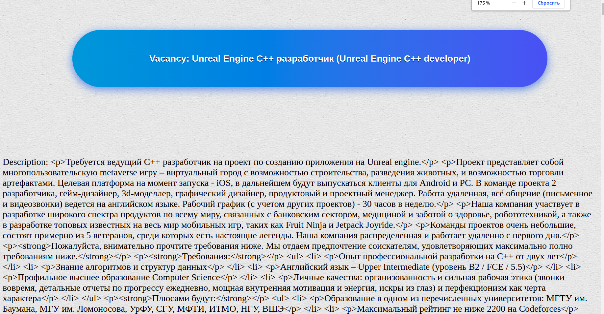

 
<h1> vacancies_analysis</h1> 

A fairly simple django job parser. A set of vacancies,
taking into account salaries in 3 currencies (rubles, euros, US dollars).
And also makes a selection of the main skills for the vacancies you are looking
for. According to the weather api, the site recommends the day for the interview
with the best weather, because good weather cheers you up.
<h3>APIs: </h3>
  
* hh (vacancies)  
* openweather  
* fixer (exchange rates) 
   
  
  
  

  Model of vacancies:  

name | description | salary | skills_name  | 
------ |    ------ |    ----|---------| 

 
Some my recomendation : 
* json understandable view  - https://jsoneditoronline.org/#left=local.risequ&right=local.hubowi  

P.S. 404 page taken from an open source :
http://seo-design.net/design/beautifully-designed-404-error-pages
